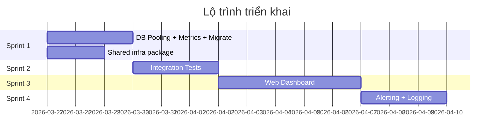

# Kế Hoạch Triển Khai Các Phần Còn Thiếu

## Tổng quan

10 đầu việc còn thiếu được chia thành **4 Sprint**, sắp xếp theo thứ tự phụ thuộc và ưu tiên.



---

## Sprint 1 — Infrastructure Hardening `[3 ngày]`

### 1.1 Database Connection Pooling

#### [MODIFY] [postgres.go](file:///wsl.localhost/Ubuntu/home/datnm/projects/analysis-stock/go-services/internal/database/postgres.go)

Thêm connection pool config sau khi `gorm.Open`:
```go
sqlDB, _ := db.DB()
sqlDB.SetMaxOpenConns(getIntEnv("DB_MAX_OPEN_CONNS", 25))
sqlDB.SetMaxIdleConns(getIntEnv("DB_MAX_IDLE_CONNS", 10))
sqlDB.SetConnMaxLifetime(getDurationEnv("DB_CONN_MAX_LIFETIME", "5m"))
```

#### [MODIFY] [config.go](file:///wsl.localhost/Ubuntu/home/datnm/projects/analysis-stock/go-services/internal/config/config.go)

Thêm 3 fields vào [DatabaseConfig](file://wsl.localhost/Ubuntu/home/datnm/projects/analysis-stock/go-services/internal/config/config.go#47-55):
- `MaxOpenConns int`
- `MaxIdleConns int`
- `ConnMaxLifetime time.Duration`

---

### 1.2 Prometheus Metrics Endpoint

#### [NEW] `go-services/internal/middleware/metrics.go`

Sử dụng `github.com/prometheus/client_golang`:
- `http_requests_total` — Counter (method, path, status)
- `http_request_duration_seconds` — Histogram (method, path)
- `cache_hits_total` / `cache_misses_total` — Counter (cache_type)
- `circuit_breaker_state` — Gauge (service, state)
- Gin middleware wrapper ghi nhận request metrics

#### [MODIFY] [cmd/api-gateway/main.go](file://wsl.localhost/Ubuntu/home/datnm/projects/analysis-stock/go-services/cmd/api-gateway/main.go)

- Import metrics middleware
- Mount `/metrics` endpoint (không qua auth)
- Register Prometheus handler

#### [MODIFY] `monitoring/prometheus.yml`

Thêm scrape config cho các Go services:
```yaml
scrape_configs:
  - job_name: 'api-gateway'
    static_configs:
      - targets: ['api-gateway:8080']
  - job_name: 'technical-agent'
    static_configs:
      - targets: ['technical-agent:8080']
```

---

### 1.3 Database Migration Tool (golang-migrate)

#### [MODIFY] [go.mod](file://wsl.localhost/Ubuntu/home/datnm/projects/analysis-stock/go-services/go.mod)

Thêm dependency: `github.com/golang-migrate/migrate/v4`

#### [MODIFY] [database/postgres.go](file://wsl.localhost/Ubuntu/home/datnm/projects/analysis-stock/go-services/internal/database/postgres.go)

Thay `models.AutoMigrate(db)` bằng:
```go
if os.Getenv("DB_AUTO_MIGRATE") == "true" {
    models.AutoMigrate(db) // dev only
} else {
    // Production: expect migrations run via CLI
}
```

#### [MODIFY] [Makefile](file://wsl.localhost/Ubuntu/home/datnm/projects/analysis-stock/go-services/Makefile) hoặc README

Thêm commands:
```makefile
migrate-up:
    migrate -path migrations -database "$(DB_DSN)" up
migrate-down:
    migrate -path migrations -database "$(DB_DSN)" down 1
migrate-create:
    migrate create -ext sql -dir migrations -seq $(name)
```

> [!NOTE]
> 3 file migration đã có sẵn trong `migrations/` (init_schema, n8n_database, partition_tables).

---

### 1.4 Extract Shared Infra Package (Code Review #7)

#### [NEW] `go-services/internal/app/setup.go`

Extract boilerplate từ 4 `cmd/*/main.go` vào 1 package chung:
```go
package app

type Infrastructure struct {
    DB    *gorm.DB
    Redis *redis.Client
    Cfg   config.Config
}

func Setup(ctx context.Context) (*Infrastructure, error) { ... }
func (i *Infrastructure) Close() { ... }
```

#### [MODIFY] [cmd/api-gateway/main.go](file://wsl.localhost/Ubuntu/home/datnm/projects/analysis-stock/go-services/cmd/api-gateway/main.go), [cmd/technical-agent/main.go](file://wsl.localhost/Ubuntu/home/datnm/projects/analysis-stock/go-services/cmd/technical-agent/main.go), [cmd/forecast-agent/main.go](file://wsl.localhost/Ubuntu/home/datnm/projects/analysis-stock/go-services/cmd/forecast-agent/main.go), [cmd/master-orchestrator/main.go](file://wsl.localhost/Ubuntu/home/datnm/projects/analysis-stock/go-services/cmd/master-orchestrator/main.go)

Thay ~30 dòng boilerplate bằng:
```go
infra, err := app.Setup(ctx)
defer infra.Close()
```

---

## Sprint 2 — Integration Tests `[3 ngày]`

### 2.1 Testcontainers Setup

#### [NEW] `go-services/internal/testutil/containers.go`

Sử dụng `github.com/testcontainers/testcontainers-go`:
```go
func SetupPostgres(ctx context.Context) (*gorm.DB, func())
func SetupRedis(ctx context.Context) (*redis.Client, func())
```

#### [NEW] `go-services/tests/integration/analysis_test.go`

Test flow đầy đủ:
1. Start Postgres + Redis containers
2. Tạo [TechnicalService](file://wsl.localhost/Ubuntu/home/datnm/projects/analysis-stock/go-services/internal/services/technical_service.go#24-29) với real DB/Redis
3. Gọi [Analyze("VNM")](file://wsl.localhost/Ubuntu/home/datnm/projects/analysis-stock/go-services/internal/services/technical_service.go#71-220) → kiểm tra kết quả lưu DB + cache Redis
4. Gọi lần 2 → kiểm tra cache hit

#### [NEW] `go-services/tests/integration/forecast_test.go`

Test flow forecast:
1. Start containers + mock sentiment HTTP server
2. `ForecastService.Forecast("FPT")` → kiểm tra weighted score logic
3. Verify DB persistence

#### [NEW] `go-services/tests/integration/job_queue_test.go`

Test async job queue:
1. Start Redis container
2. `EnqueueJob(symbols)` → verify stream entry
3. [StartWorker](file://wsl.localhost/Ubuntu/home/datnm/projects/analysis-stock/go-services/internal/services/job_queue.go#123-164) → verify job completed
4. `GetJobStatus` → verify status transitions

#### [MODIFY] [.github/workflows/ci.yml](file://wsl.localhost/Ubuntu/home/datnm/projects/analysis-stock/.github/workflows/ci.yml)

Thay integration test bước `docker compose` bằng `go test -tags=integration`:
```yaml
- name: Run integration tests
  run: |
    cd go-services
    go test -tags=integration -v ./tests/integration/...
```

---

## Sprint 3 — Web Dashboard `[5 ngày]`

> [!IMPORTANT]
> Web Dashboard đã có skeleton Next.js App Router với 3 pages ([page.tsx](file://wsl.localhost/Ubuntu/home/datnm/projects/analysis-stock/web-dashboard/app/page.tsx), `analysis/page.tsx`, `reports/page.tsx`) và API helpers ([lib/api.ts](file://wsl.localhost/Ubuntu/home/datnm/projects/analysis-stock/web-dashboard/lib/api.ts)). Sprint này hoàn thiện UI.

### 3.1 Dependencies & Design System

#### [MODIFY] [web-dashboard/package.json](file://wsl.localhost/Ubuntu/home/datnm/projects/analysis-stock/web-dashboard/package.json)

Thêm:
- `recharts` — charting (lightweight, React-native)
- `@tanstack/react-query` — data fetching + caching
- `clsx` — conditional classnames

#### [MODIFY] [web-dashboard/app/globals.css](file://wsl.localhost/Ubuntu/home/datnm/projects/analysis-stock/web-dashboard/app/globals.css)

Thiết kế design system:
- CSS custom properties cho color palette (dark mode default)
- Typography scale (Inter font)
- Card, table, badge, skeleton components
- Chart container styles
- Responsive breakpoints

### 3.2 Pages

#### [MODIFY] [web-dashboard/app/page.tsx](file://wsl.localhost/Ubuntu/home/datnm/projects/analysis-stock/web-dashboard/app/page.tsx) — Dashboard chính

Tính năng hoàn thiện:
- Stat cards với animation (count-up)
- Watchlist table có real data từ API
- Sparkline mini-charts cho xu hướng 7 ngày
- Market summary card
- Top picks carousel

#### [MODIFY] [web-dashboard/app/analysis/page.tsx](file://wsl.localhost/Ubuntu/home/datnm/projects/analysis-stock/web-dashboard/app/analysis/page.tsx) — Chi tiết phân tích

Tính năng:
- Symbol search input
- Technical indicator cards (RSI gauge, MACD histogram, Bollinger bands)
- Signal badge + confidence meter
- Reasons list
- Price/volume charts (candlestick hoặc line via recharts)

#### [MODIFY] [web-dashboard/app/reports/page.tsx](file://wsl.localhost/Ubuntu/home/datnm/projects/analysis-stock/web-dashboard/app/reports/page.tsx) — Báo cáo hàng ngày

Tính năng:
- Date picker để xem báo cáo cũ
- Signal distribution pie chart
- Top picks table với sorting
- Market commentary

#### [NEW] `web-dashboard/app/forecast/page.tsx` — Dự báo

Tính năng:
- Symbol input → gọi `/api/v1/forecast/:symbol`
- Score breakdown (tech / sentiment / market) với radar chart
- Support/resistance levels visual
- Recommendation badge + reasoning

#### [NEW] `web-dashboard/app/components/` — Shared components

- `Navbar.tsx` — Navigation sidebar
- `SignalBadge.tsx` — Buy/Sell/Hold với màu sắc
- `ScoreGauge.tsx` — Circular progress indicator
- `Skeleton.tsx` — Loading placeholders
- `Chart.tsx` — Wrapper cho recharts

### 3.3 API Layer

#### [MODIFY] [web-dashboard/lib/api.ts](file://wsl.localhost/Ubuntu/home/datnm/projects/analysis-stock/web-dashboard/lib/api.ts)

Thêm typed fetch functions:
```typescript
export async function getTechnicalAnalysis(symbol: string): Promise<TechnicalResult>
export async function getForecast(symbol: string): Promise<ForecastResult>
export async function getDailyReport(date?: string): Promise<DailyReport>
```

---

## Sprint 4 — Operational Readiness `[3 ngày]`

### 4.1 Alerting

#### [NEW] `go-services/internal/alerting/alerter.go`

Interface-based alerting:
```go
type Alerter interface {
    Send(ctx context.Context, alert Alert) error
}
type TelegramAlerter struct { ... }  // reuse telegram-bot APIClient
type SlackAlerter struct { ... }     // webhook-based
```

#### [MODIFY] [orchestrator_service.go](file://wsl.localhost/Ubuntu/home/datnm/projects/analysis-stock/go-services/internal/services/orchestrator_service.go)

Gửi alert khi:
- Daily report có >50% tín hiệu Sell → "Thị trường tiêu cực"
- Circuit breaker trip → "Service X down"
- Mock data fallback triggered → "Cảnh báo: dùng dữ liệu giả"

### 4.2 Structured Logging (Loki-ready)

#### [NEW] `go-services/internal/middleware/structured_logger.go`

Replace current [Logger()](file://wsl.localhost/Ubuntu/home/datnm/projects/analysis-stock/go-services/internal/middleware/logging.go#10-37) middleware với JSON-formatted logger:
```go
slog.Info("request",
    "method", c.Request.Method,
    "path", path,
    "status", status,
    "latency_ms", latency.Milliseconds(),
    "request_id", c.GetString("request_id"),
    "client_ip", c.ClientIP(),
)
```

#### [MODIFY] [docker-compose.yml](file://wsl.localhost/Ubuntu/home/datnm/projects/analysis-stock/docker-compose.yml)

Thêm Loki + Promtail service (profile `monitoring`):
```yaml
loki:
  image: grafana/loki:2.9.0
  ports: ["3100:3100"]
  profiles: [monitoring]

promtail:
  image: grafana/promtail:2.9.0
  volumes:
    - /var/log:/var/log
  profiles: [monitoring]
```

---

## Verification Plan

### Automated Tests

| Sprint | Lệnh chạy | Mô tả |
|--------|-----------|-------|
| 1 | `cd go-services && go build ./...` | Verify compilation sau thay đổi |
| 1 | `cd go-services && go test ./...` | Unit tests vẫn pass |
| 1 | `curl localhost:8080/metrics` | Verify Prometheus endpoint trả metrics |
| 2 | `cd go-services && go test -tags=integration -v ./tests/integration/...` | Integration tests với testcontainers |
| 3 | `cd web-dashboard && npm run build` | Verify Next.js build không lỗi |
| 4 | `cd go-services && go test ./...` | Verify alerting + logging tests |

### Manual Verification

| Sprint | Bước kiểm tra |
|--------|--------------|
| 1 | Chạy `docker compose --profile monitoring up -d`, mở Grafana tại `localhost:3001`, verify datasource Prometheus hiển thị metrics |
| 1 | Set `DB_MAX_OPEN_CONNS=5`, chạy benchmark với `hey -n 100 -c 10 http://localhost:8080/api/v1/technical/VNM`, verify không connection exhaustion |
| 3 | Mở `localhost:3000`, verify dashboard hiển thị data từ API, navigate qua tất cả pages |
| 4 | Trigger circuit breaker (stop sentiment service), verify alert gửi qua Telegram |

> [!WARNING]
> Sprint 3 (Web Dashboard) là phần lớn nhất (~5 ngày). Nếu cần giảm scope, có thể bỏ forecast page và charts, chỉ focus vào data tables trước.
